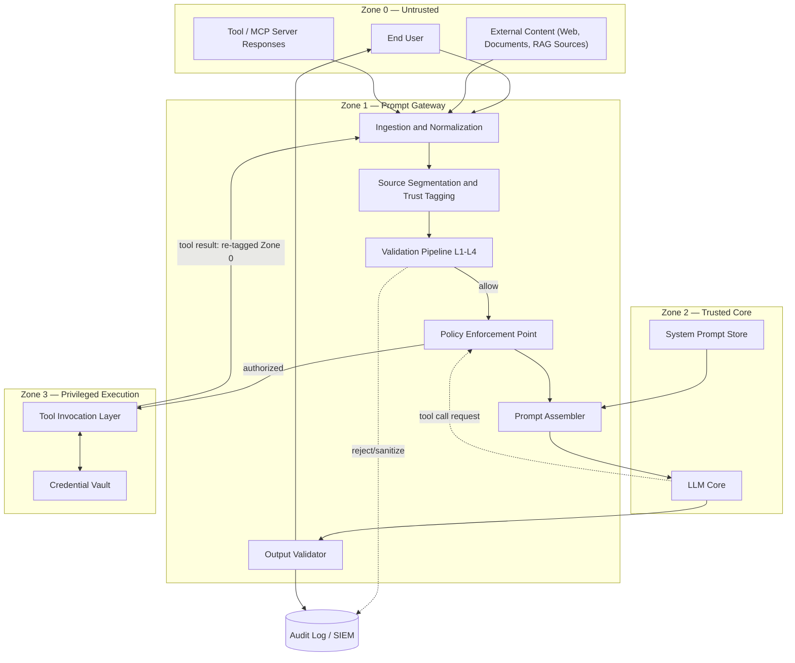
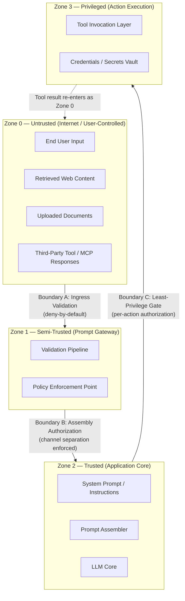
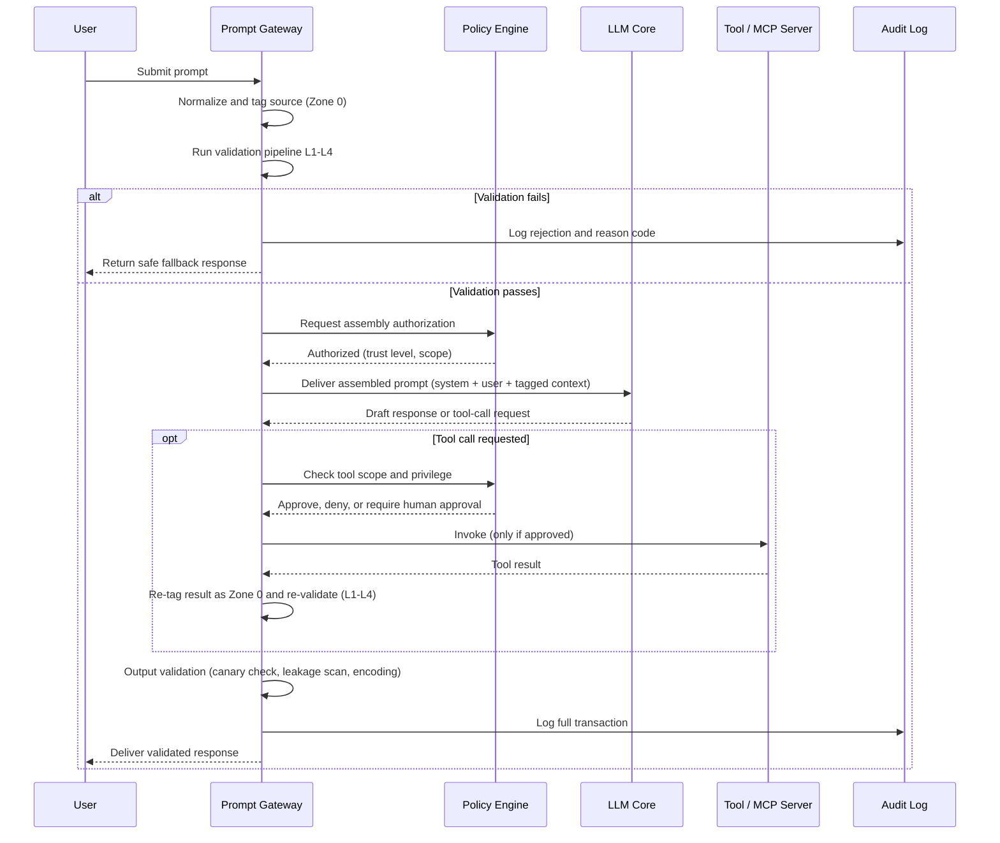

# Prompt Gateway
### NeuralStack | MS — AI Security Blueprint Component

**Component ID:** BP-COMP-01
**Category:** Ingress / Input-Trust Layer
**Primary Threat Class:** Prompt Injection (OWASP LLM01:2025; MITRE ATLAS AML.T0051, sub-techniques AML.T0051.000 Direct / AML.T0051.001 Indirect; adjacent AML.T0054 LLM Jailbreak Injection)

---

## 1. Purpose

The Prompt Gateway is the mandatory ingress control point through which all natural-language content — user input, retrieved documents, tool/MCP responses, and any other externally sourced text — must pass before it is permitted to influence an LLM's context window. Its purpose is to enforce the principle that **instructions and data must be provenance-tagged and independently authorized**, rather than trusted implicitly because they arrived in the same channel as legitimate system instructions.

The Gateway does not attempt to achieve deterministic prevention of prompt injection — no such guarantee exists for autoregressive language models processing untrusted natural language. Instead, it implements defense-in-depth: layered detection, privilege segmentation, and containment, such that a successful injection is degraded from "arbitrary model hijack" to "bounded, observable, and recoverable deviation."

## 2. Responsibilities

- Ingest and normalize all text destined for the LLM context window, regardless of source.
- Tag every input segment with a **provenance label** and **trust level** (e.g., `user:authenticated`, `external:web`, `external:rag`, `tool:mcp-response`).
- Execute the multi-layer validation pipeline (Section 11) against every segment prior to prompt assembly.
- Enforce separation between the system/instruction channel and the data channel during prompt assembly (structured querying / spotlighting).
- Authorize or deny privilege escalation requests that originate from LLM output (e.g., tool calls, agentic actions) against a least-privilege policy.
- Re-validate any content returned from tool or MCP invocations as newly untrusted input before it re-enters the context window.
- Emit structured audit events for every allow/sanitize/block decision.
- Enforce token- and request-level consumption budgets to mitigate LLM10:2025 (Unbounded Consumption) where injection is used as a resource-exhaustion vector.

## 3. Inputs

| Input | Source Trust Level | Notes |
|---|---|---|
| End-user prompt | Semi-trusted (authenticated) / Untrusted (anonymous) | Subject to per-session rate limiting |
| Retrieved RAG passages | Untrusted | Treated identically to attacker-controlled web content |
| Uploaded documents (PDF, DOCX, images, etc.) | Untrusted | Includes OCR/vision-extracted text and embedded metadata |
| Web content fetched by the agent | Untrusted | Includes hidden/invisible text, HTML comments, alt-text |
| Tool / MCP server responses | Untrusted | Even from internally operated MCP servers, unless individually attested |
| System prompt / developer instructions | Trusted | Originates exclusively from the Prompt Assembler's trusted store, never from the ingress path |
| Conversation history | Inherited trust level of original turn | Provenance labels persist across turns |

## 4. Outputs

- **Assembled prompt** delivered to the LLM Core, with instruction and data channels structurally separated (e.g., via delimiters, structured message roles, or a dual-LLM privileged/quarantined split).
- **Validation verdicts**: allow / sanitize / block, each with a machine-readable reason code mapped to an ATLAS technique or OWASP LLM01 sub-category.
- **Sanitized/rewritten segments** where partial remediation (rather than outright rejection) is policy-permitted.
- **Tool authorization decisions** forwarded to the Tool Invocation Layer (allow/deny/require human approval).
- **Audit records** to the Observability stack (Section 10).
- **Safe-fallback responses** to the user when a request is blocked, without revealing internal detection logic (to avoid enabling adaptive attacks).

## 5. Dependencies

- **Policy Engine** (shared Blueprint component) — supplies trust-level-to-privilege mappings and tool-scope rules; the Gateway is a policy enforcement point (PEP), not the policy decision point (PDP).
- **MCP Security Scanner** — the Gateway consumes its static/taint-analysis findings to pre-classify the trust level of connected MCP servers and their declared tool schemas before runtime.
- **Secrets Vault / Credential Broker** — the Gateway never receives raw credentials; it only forwards authorization decisions that the Tool Invocation Layer resolves against the vault.
- **Audit Log / SIEM** — sink for all Gateway telemetry; see Section 10.
- **LLM Core** — the protected asset the Gateway exists to shield; the Gateway assumes the LLM Core has no independent capacity to distinguish instructions from data and therefore treats that separation as its own responsibility.
- **Canary/Honeytoken Service** — issues per-session unique tokens embedded in the system prompt to detect exfiltration or verbatim system-prompt leakage (LLM07:2025).

## 6. Trust Boundaries

Four zones are defined, each separated by an explicit, independently enforced boundary (see Section 12.3 for the diagram):

1. **Zone 0 — Untrusted**: end users, web content, uploaded documents, third-party tool/MCP output.
2. **Zone 1 — Semi-Trusted (Prompt Gateway)**: validation pipeline and policy enforcement point. Nothing in this zone may write directly to the system-prompt store.
3. **Zone 2 — Trusted (Application Core)**: system prompt store, prompt assembler, LLM Core. Content only enters this zone after passing Boundary A (ingress validation) and Boundary B (assembly authorization).
4. **Zone 3 — Privileged (Action Execution)**: tool invocation layer and credential vault, gated by Boundary C (least-privilege authorization), which requires an explicit, policy-checked grant per action rather than inherited trust from the LLM's output.

The critical invariant: **trust cannot be upgraded implicitly**. Content crossing from Zone 0 to Zone 2 (e.g., a tool result being reasoned over by the LLM) is re-tagged as Zone 0 provenance and re-enters the validation pipeline — it does not inherit Zone 2 trust merely because the LLM Core is the one that requested it.

## 7. Protected Assets

- System prompt / instruction confidentiality and integrity (LLM07:2025 System Prompt Leakage).
- Model behavioral integrity — resistance to instruction override (LLM01:2025).
- Downstream tool and agentic action authorization (LLM06:2025 Excessive Agency).
- Sensitive data accessible via context (PII, credentials, proprietary content) (LLM02:2025 Sensitive Information Disclosure).
- Compute/token budget and service availability (LLM10:2025 Unbounded Consumption).
- Output integrity for any downstream consumer of LLM output (LLM05:2025 Improper Output Handling), e.g. where output is rendered in a browser or executed as code.

## 8. Security Objectives

1. No untrusted input segment shall be interpretable by the LLM as a system-level instruction.
2. Every privilege-bearing action requested by the model shall be independently authorized against least-privilege policy, never trusted solely because the model requested it.
3. Every allow/block decision shall be deterministic given identical input and policy state, and fully logged for post-hoc investigation.
4. System prompt content shall not be recoverable verbatim through model output under adversarial querying (verified via canary tokens).
5. Detection logic and thresholds shall not be inferable by an external attacker from Gateway responses (avoid oracle behavior).
6. The Gateway shall degrade gracefully — a pipeline component failure defaults to deny, not allow.

## 9. Security Controls

**Preventive**
- Structured prompt assembly with explicit role/channel separation (system vs. user vs. tool-data), avoiding string-concatenation-based prompt construction.
- Spotlighting / provenance delimiting of untrusted content (e.g., datamarking, encoding untrusted segments distinctly from instructions).
- Dual-LLM pattern for high-risk agentic flows: a privileged orchestrator LLM with no direct exposure to untrusted content, and a quarantined LLM that processes untrusted content but holds no tool-invocation capability.
- Allowlisting of permitted tool/action schemas; deny-by-default for any tool call not explicitly declared in the policy manifest.
- Canary/honeytoken embedding in system prompts to detect leakage attempts.
- Least-privilege credential scoping — the Gateway/Tool Invocation Layer never holds standing credentials broader than the single action being authorized.

**Detective**
- Layered validation pipeline (Section 11): syntactic normalization, pattern/heuristic matching against known jailbreak/injection corpora, semantic classification via an independent LLM-based judge, and contextual policy checks.
- Instruction-vs-data classifiers trained/prompted specifically to flag content that exhibits imperative structure within a data-typed segment.
- Output scanning for canary token presence, system-prompt fragments, and known exfiltration patterns (e.g., markdown-image or URL-based side channels).
- Anomaly detection on tool-call frequency, scope, and sequencing (excessive agency signals).

**Corrective / Containment**
- Automatic quarantine of sessions exhibiting repeated injection attempts, pending human review.
- Human-in-the-loop confirmation gates for any tool action classified as high-impact (data export, financial transaction, credential change, irreversible deletion).
- Circuit breakers on token/request consumption per session and per upstream source.
- Rollback/undo hooks for agentic actions where technically feasible.

## 10. Observability

- **Structured logging**: every Gateway decision logged with prompt hash (not raw content, to limit sensitive-data sprawl in logs), provenance tags, matched rule/technique ID (OWASP LLM0x / ATLAS AML.Txxxx), and verdict.
- **Metrics**: block rate by source type, false-positive rate (via sampled human review), mean validation latency per layer, canary-token trigger count, tool-authorization denial rate.
- **Alerting**: real-time alert on canary-token exfiltration, on any Zone-3 authorization request lacking a corresponding Zone-1 validation record (indicating a bypass), and on statistically anomalous spikes in a given injection technique.
- **SIEM integration**: Gateway events forwarded in a normalized schema for correlation with broader infrastructure telemetry, enabling detection of injection chained with traditional attack techniques (e.g., LLM01 leading to downstream SSRF or RCE via improper output handling).
- **Adversarial regression suite**: the Gateway's own detection layers are continuously benchmarked against an internal corpus of known and novel injection payloads (sourced from red-team engagements and public disclosures) to detect coverage regression before deployment.

## 11. Implementation Patterns

The Prompt Gateway follows the same layered-pipeline philosophy used elsewhere in the Blueprint (cf. MCP Security Scanner's static/taint/semantic/runtime layering), applied here to prompt-level content:

- **Layer 1 — Syntactic Normalization**: Unicode normalization, homoglyph and invisible-character stripping, encoding detection (base64/hex/ROT-obfuscated payloads), structural/length limits.
- **Layer 2 — Pattern & Heuristic Detection**: signature and regex matching against known jailbreak phrasing, role-token/delimiter-injection detection (e.g., attempts to forge `system:`-style markers), known-corpus similarity matching.
- **Layer 3 — Semantic Classification**: an independent LLM-based judge (architecturally isolated from the primary LLM Core, ideally a distinct model or a constrained-capability call) performs intent classification and instruction-vs-data classification; canary-token integrity is checked at this layer.
- **Layer 4 — Contextual Policy Enforcement**: source trust-level lookup, privilege/tool-scope check against the Policy Engine, and consumption-budget check.

Recommended architectural patterns to combine with the pipeline:
- **Instruction hierarchy enforcement** at the model level (where the underlying model supports distinguishing system/developer/user privilege tiers) as a complementary, not substitute, control.
- **CaMeL-style / dual-LLM containment** for agentic workflows: a privileged planner that never sees raw untrusted content directly, delegating untrusted-content processing to a capability-constrained quarantined LLM whose output is treated as data, not instruction, by the planner.
- **Retrieval-time provenance tagging** in RAG pipelines, so that trust labels are attached at ingestion into the vector store, not reconstructed after retrieval.
- **Structured querying** (e.g., delimiting user data in a dedicated, clearly bounded field within the API call structure) rather than free-text concatenation into a single prompt string.

## 12. Architecture Diagrams

### 12.1 High-Level Prompt Gateway Architecture

### 12.2 Prompt Validation Pipeline

```mermaid
flowchart LR
    IN["Incoming Segment\n(user / external / tool)"] --> L1

    subgraph L1["Layer 1 — Syntactic Normalization"]
        A1[Unicode / homoglyph normalization]
        A2[Encoding detection: base64, hex, obfuscation]
        A3[Length and structure checks]
    end

    L1 --> L2

    subgraph L2["Layer 2 — Pattern and Heuristic Detection"]
        B1[Signature and regex matching]
        B2[Known jailbreak corpus similarity]
        B3[Delimiter / role-token forgery check]
    end

    L2 --> L3

    subgraph L3["Layer 3 — Semantic Classification"]
        C1[LLM-based judge: intent classification]
        C2[Instruction-vs-data classifier]
        C3[Canary token integrity check]
    end

    L3 --> L4

    subgraph L4["Layer 4 — Contextual Policy Enforcement"]
        D1[Source trust-level lookup]
        D2[Privilege / tool-scope check]
        D3[Consumption budget check]
    end

    L4 --> DEC{Decision}
    DEC -->|Allow| PASS[Forward to Prompt Assembler]
    DEC -->|Sanitize| SAN[Rewrite / Strip / Quarantine]
    DEC -->|Block| REJ[Reject and Log]
```

### 12.3 Trust Boundary Diagram

### 12.4 Prompt Lifecycle Diagram

---

## Reference Mappings

| Blueprint Control | OWASP LLM Top 10 (2025) | MITRE ATLAS |
|---|---|---|
| Ingress validation pipeline | LLM01: Prompt Injection | AML.T0051, AML.T0051.000, AML.T0051.001 |
| Canary token / system prompt protection | LLM07: System Prompt Leakage | AML.T0051 (exfiltration chains), AML.T0024 |
| Output validator | LLM05: Improper Output Handling | — |
| Tool authorization / least privilege | LLM06: Excessive Agency | AML.T0070 (where injection escalates to unauthorized tool use) |
| Consumption budget enforcement | LLM10: Unbounded Consumption | — |
| Source trust tagging (RAG) | LLM02: Sensitive Information Disclosure; LLM08: Vector and Embedding Weaknesses | AML.T0043 (staged poisoning), AML.T0051.001 |

*Mappings reflect the OWASP Top 10 for LLM Applications (2025 edition, LLM01:2025–LLM10:2025) and MITRE ATLAS v5.1.0 taxonomy.*

